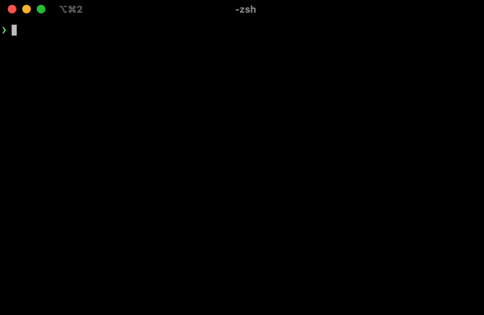

# git story + story-trailer precommit

This repo contains two utilities:
1. a git extension `git story` to set the context of the story being worked on.
2. a pre-commit hook `story-trailer` that works with [pre-commit](https://pre-commit.com/) to automatically add story trails to your commit messages.

<br>



<br>


## ⚙️ setup `git story`

Create a file for the git extension.

⚠️ Always read any script before downloading or executing them from the internet ⚠️

```zsh
sudo curl https://raw.githubusercontent.com/jessicamann/precommit-hooks/main/git-story-template -o /usr/local/bin/git-story && sudo chmod +x /usr/local/bin/git-story
```

Now use it!
```
git story
```

## 🤖 add "story-trailer" hoook to your repo

In your `.pre-commit-config.yaml`, add the hook

```yaml
# by default, only 'pre-commit' is installed
# if you do not already have "prepare-commit-msg",
# make sure to run "pre-commit  install" again
default_install_hook_types: [pre-commit,prepare-commit-msg]
repos:
-   ...your other hooks
-   repo: https://github.com/jessicamann/precommit-hooks
    rev: v0.0.1
    hooks:
    -   id: story-trailer
```

## 🎭 behind the scenes

### On the topic of global git story reference...

The story reference is persisted in your XDG config home, so you don't need
to re-specify it when starting a new session, creating a new commit, or
moving across repos.

I'm assuming you're limiting your WIP to one story at a time.

### On the topic of story reference enforcements...

Sometimes, you just don't have a story. And that's ok.

No need to make it difficult for those making changes and enforcing what would be an unuseful trailer:

"Story: TEAM-000"
